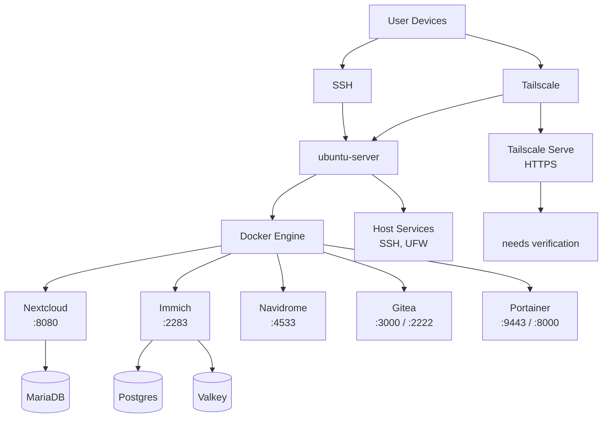
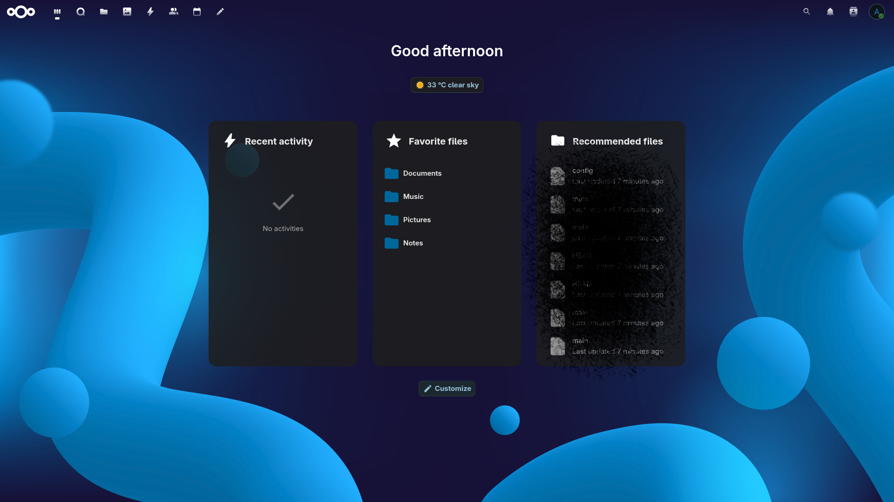
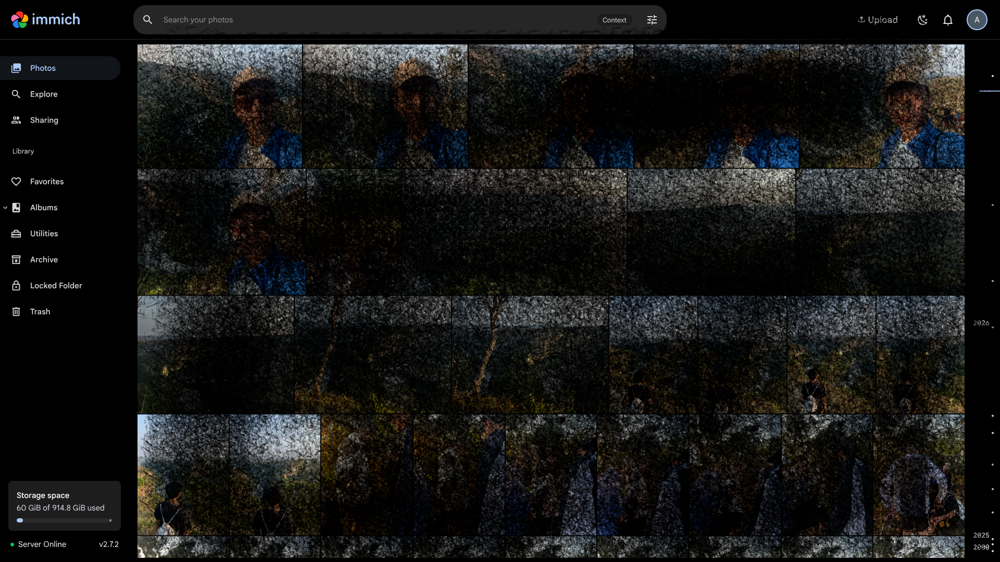
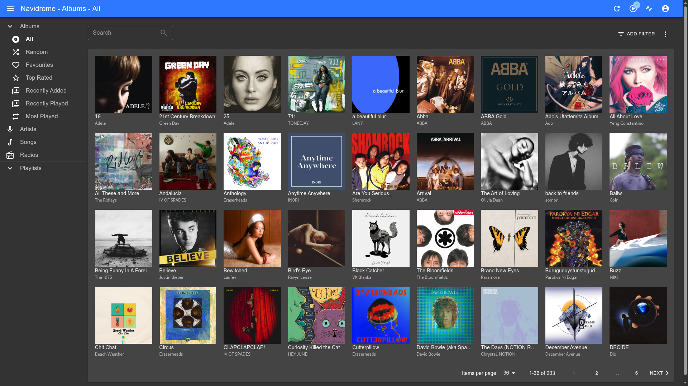
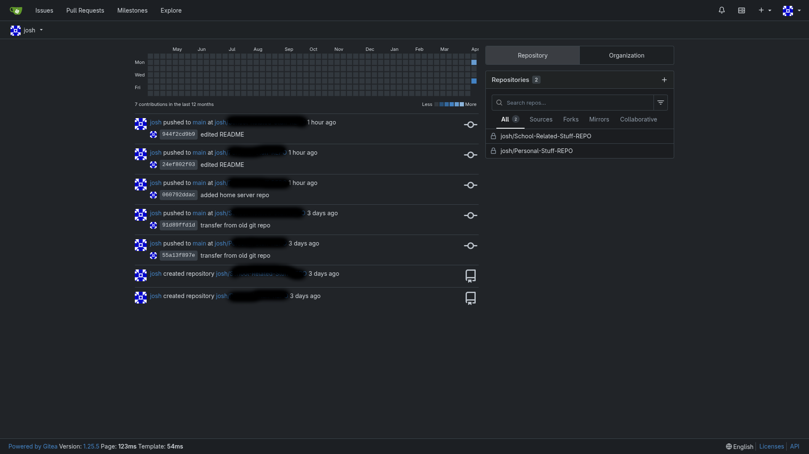
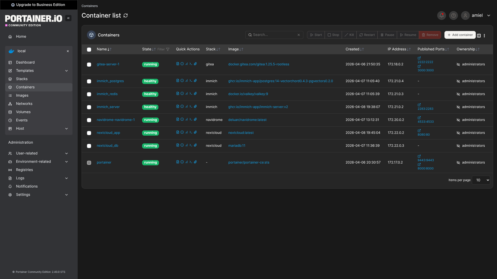

# How I Replaced Cloud Services With My Home Server

This repository documents how I use an Ubuntu home server to replace a handful of cloud services with self-hosted alternatives. It covers the current stack, how the services are organized, and where each app is managed from.

Current setup:
- Hostname: `ubuntu-server`
- OS: `Ubuntu 24.04.4 LTS`
- Kernel: `Linux 6.8.0-107-generic x86_64`
- Main access path: Tailscale

## Overview

The server is a self-hosted Docker application host that replaces common cloud services for files, photos, music, code hosting, and server management.

Main services I currently run:
- Nextcloud
- Immich
- Navidrome
- Gitea
- Portainer
- Tailscale
- Docker
- SSH

## What This Replaces

| Cloud Service Type | Self-Hosted Replacement |
| --- | --- |
| File sync and personal cloud storage | Nextcloud |
| Photo backup and gallery apps | Immich |
| Music streaming for my own library | Navidrome |
| Hosted Git platforms for personal projects | Gitea |
| Cloud-style server dashboards | Portainer |

## Architecture Diagram



## Host Information

| Item | Value |
| --- | --- |
| Hostname | `ubuntu-server` |
| Operating System | `Ubuntu 24.04.4 LTS` |
| Kernel | `Linux 6.8.0-107-generic x86_64` |
| Storage | `/dev/sda2` `ext4` |
| Root Disk Size | `915G` |
| Used Space | `60G` |
| Free Space | `809G` |
| Remote Access | `SSH` + `Tailscale` |

## Network Summary

Addresses I use:
- LAN: `<lan-ip>`
- Tailscale: `<tailscale-ip>`

Tailnet HTTPS domain:
- `https://<tailnet-domain>`

Notes:
- `ufw` is enabled.
- Default policy is deny for incoming traffic.
- `8080/tcp` is allowed from `<tailnet-cidr>`.
- Tailscale Serve is configured to proxy `/` on the tailnet domain to `<local-proxy-target>`.
- The `<local-proxy-target>` route still needs verification.

## Core System Services

Main host-level services:
- `ssh`
- `docker`
- `containerd`
- `cron`
- `tailscaled`
- `NetworkManager`
- `systemd-resolved`
- `rsyslog`
- `snapd`
- `unattended-upgrades`

## Application Stack

All major apps on this server are containerized with Docker.

| Service | Replaces | Purpose | Container(s) | Exposed Port(s) | Deployment Directory |
| --- | --- | --- | --- | --- | --- |
| Nextcloud | Dropbox / Google Drive | Personal cloud storage and file sync | `nextcloud_app`, `nextcloud_db` | `8080` | `/home/josh/nextcloud` |
| Immich | Google Photos | Photo and video backup/gallery | `immich_server`, `immich_postgres`, `immich_redis` | `2283` | `/home/josh/immich-app` |
| Navidrome | Cloud music service for a personal library | Music streaming server | `navidrome-navidrome-1` | `4533` | `/home/josh/navidrome` |
| Gitea | GitHub / GitLab for personal hosting | Self-hosted Git service | `gitea-server-1` | `3000`, `2222` | `/home/josh/gitea` |
| Portainer | Hosted container dashboards | Docker management UI | `portainer` | `9443`, `8000` | Standalone container |

## Service Details

### Nextcloud

Purpose:
- Replaces file storage and sync services such as Google Drive or Dropbox
- Provides browser-based file access on my own server

Container images:
- `nextcloud:latest`
- `mariadb:11`

Compose project:
- `nextcloud`

Deployment path:
- `/home/josh/nextcloud`

Important files and directories:
- `/home/josh/nextcloud/docker-compose.yml`
- `/home/josh/nextcloud/data`
- `/home/josh/nextcloud/db`

Access:
- `<tailscale-ip>:8080`

Restart policy:
- `unless-stopped`

### Screenshot


```
### Immich

Purpose:
- Replaces cloud photo backup services such as Google Photos
- Handles media browsing and timeline view on my own server

Container images:
- `ghcr.io/immich-app/immich-server:v2`
- `ghcr.io/immich-app/postgres:14-vectorchord0.4.3-pgvectors0.2.0`
- `valkey/valkey:9`

Compose project:
- `immich`

Deployment path:
- `/home/josh/immich-app`

Important files and directories:
- `/home/josh/immich-app/docker-compose.yml`
- `/home/josh/immich-app/.env`
- `/home/josh/immich-app/library`
- `/home/josh/immich-app/postgres`

Access:
- `2283/tcp`

Restart policy:
- `always`

### Screenshot




### Navidrome

Purpose:
- Replaces cloud music access for my personal music library

Container image:
- `deluan/navidrome:latest`

Compose project:
- `navidrome`

Deployment path:
- `/home/josh/navidrome`

Important files and directories:
- `/home/josh/navidrome/docker-compose.yml`
- `/home/josh/navidrome/data`

Access:
- `4533/tcp`

Restart policy:
- `unless-stopped`

### Screenshot




### Gitea

Purpose:
- Replaces hosted Git platforms for my personal projects
- Provides a web UI and Git over SSH from my own server

Container image:
- `docker.gitea.com/gitea:1.25.5-rootless`

Compose project:
- `gitea`

Deployment path:
- `/home/josh/gitea`

Important files and directories:
- `/home/josh/gitea/docker-compose.yml`
- `/home/josh/gitea/data`
- `/home/josh/gitea/config`

Access:
- Web UI: `3000/tcp`
- Git SSH: `2222/tcp`

Restart policy:
- `always`

### Screenshot




### Portainer

Purpose:
- Replaces the need for a hosted dashboard by giving me a local web UI for Docker administration

Container image:
- `portainer/portainer-ce:sts`

Access:
- `9443/tcp`
- `8000/tcp`

Restart policy:
- `always`

Notes:
- Portainer appears to be running as a standalone container.

### Screenshot



## Open Ports

| Port | Service |
| --- | --- |
| `22/tcp` | SSH |
| `53/tcp`, `53/udp` | Local resolver |
| `8080/tcp` | Nextcloud |
| `2283/tcp` | Immich |
| `4533/tcp` | Navidrome |
| `3000/tcp` | Gitea web |
| `2222/tcp` | Gitea SSH |
| `8000/tcp` | Portainer edge/agent port |
| `9443/tcp` | Portainer HTTPS |
| `443/tcp` on Tailscale IP | Tailscale Serve / tailnet HTTPS |

## Deployment Layout

Application directories under `/home/josh`:
- `/home/josh/nextcloud`
- `/home/josh/immich-app`
- `/home/josh/navidrome`
- `/home/josh/gitea`

This means each major app is managed independently rather than through a single monorepo deployment directory.
